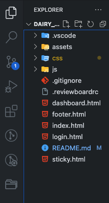

# Journal Time
Welcome to Journal Time!! My Journal is a simple and intuitive journaling application designed to help you record your thoughts, your feelings, and experiences effortlessly.

Project Repository : 
Project Name : Dairy Web SokhaNeadh 
Project Owner : Rith SokhaNeadh
Project Server : GitLab

## Description 

My name is **Rith SokhaNeadh**, I create this project to demonstrate my web development skill 
such as `html`,`css` and `javascript` .

## Installation

Clone source code

git clone 

## Prototype

Prototype For Mobile (https://www.figma.com/proto/7C7m88AsQrdJN7InHLy1t6/Diary?node-id=22-131&t=iuiBogK8oaWRmt4T-0&scaling=scale-down&content-scaling=fixed&page-id=0%3A1&starting-point-node-id=22%3A131&show-proto-sidebar=1)

Prototype For Desktop (https://www.figma.com/proto/7C7m88AsQrdJN7InHLy1t6/Diary?node-id=3-28&t=iuiBogK8oaWRmt4T-0&scaling=scale-down&content-scaling=fixed&page-id=0%3A1&starting-point-node-id=3%3A28&show-proto-sidebar=1)

UI Screen For Mobile (https://www.figma.com/proto/7C7m88AsQrdJN7InHLy1t6/Diary?node-id=22-131&t=iuiBogK8oaWRmt4T-0&scaling=scale-down&content-scaling=fixed&page-id=0%3A1&starting-point-node-id=22%3A131&show-proto-sidebar=1)

UI Screen For Desktop (https://www.figma.com/proto/7C7m88AsQrdJN7InHLy1t6/Diary?node-id=3-28&t=iuiBogK8oaWRmt4T-0&scaling=scale-down&content-scaling=fixed&page-id=0%3A1&starting-point-node-id=3%3A28&show-proto-sidebar=1)

## Install Dependencies

npm install vite

## Program Language

- HTML
- CSS
- JavaScript

## Usage
* Sign Up/Login: Create a new account or log in with your existing credentials.

* Write New Entry: Click on the "New Entry" button to create a new journal entry. Enter a title, select a date, and write your thoughts.

* View/Edit Entries: Click on any entry to view its details. Edit or delete entries as needed.

* Delete : Delete your unnecessarily note.

## Convention guide
## Table Of Contents

1. Folder structure
2. File Naming Rule
3. HTML Convention
4. CSS Convention
5. Java Script Convention
6. Comment Notation
7. Injecting Common Components
8. Git Strategy

## 1. Folder Structure

## 2. File Naming Rule

- Use lowercase for folder and file name.
- Use underscored (_) to seperate word of folder or file.
- Name folder and file according to its purpose.
- Name should be meaningful.

## 3. HTML Convention

## 3.1 Indentation

- Indent your code with 1 spaces 
### Ex:
    

    

        content here
    

    

## 4. CSS Convention

## 4.1 Class and Id 

- Class and id should be named by its purpose or feature as well as connected with hyphens(-) if it is more than one word. The name should be in lowercase.

### Ex: 
    .blue-navigator

    #menu-list

    .icon-home

- It can be used in shortcut form but make sure to give comments above the declaration.

### Ex : 
    nav = navigator 

    .nav

    #nav

- Inline code and internal code are not allowed.
- Css combinator can be used:
- Descendant Combinator :

### Ex : 
    .class1 .class2 {

    property: value;

    }
- Direct Child Combinator:    
### Ex: 
    .class1 > .class2 {

        property: value;

    }
- :nth-child() selector: This is optional

### Ex : 
    .a:nth-child(n) {

    property: value;

}
## 4.2 Style CSS
### Example :
    * {
        margin: 0px;
        padding: 0;
        box-sizing: border-box;
    }
    
    body, html {
        width: 100%;
        height: 100%;
        font-size: 16px;
        font-family: "Quicksand", sans-serif;
    }

## 4.3 Font Size
Optional

## 4.4 Font Family
font-family: "Quicksand", sans-serif;
## 5. Java Script Convention

- All variables should be declared on the top of each section with const declaration.

### Ex:
    //function to return sum

    const a = 1;

    const b = 2;

    function(a,b){

    …..

    }
    //function to return subtraction

    const c = 1;

    const d = 2;

    function(c,d){

    …..

    }

- Variables will be declared in full meaning. If the variable consists of one understandable word, it is written in lowercase. Otherwise, it will be written in camel format. Whereas global variables will be written in uppercase.

### Ex:

const celsius ; (one word variable)

const buttonToggle; (multiple word variable)

const RADIUS; (global variable)

- The function's name will be in camel format in general except it is a constructor function we use pascal format.

### Ex:

    function firstName (){

    code here

    } ****

    // general function

    function FirstName (){

    code here

    }

    //constructor function

- Use Multi-line for Object declaration.

### Ex: 
    let person {

    name : ----,

    age : ----

    }

- Script file or js file should be at the end of the body tag (<body></body>).
- Make sure to give comments of function’s purpose above the function declaration

### Ex:
  
    // Return sum
    of two values

    function (a, b){

    return a + b;

    }

## 6. Comment Notation

- Use only single line comments in css and javascript to demonstrate the purpose of style and function.

### Ex: 

    /* common h1 size */

    <!-- .h1{
    text heare

    } -->

    // function return sum

    // function sum(){
        code here
    }

- Use 1 lines comment in html to demonstrate the purpose of section

### Ex:  
    <!-- Start Animal Supporter Section -->

                *Code here*

    <!-- Start Animal Supporter Section -->
## 7. Injecting Common Components

Inside your target html file, place include tag where you want to inject another html file, and set the src property point to the html file where you want to use.

    <!-- Start Footer -->
    

        <!-- injection footer section -->
    

    <!-- End Footer -->

## 8. Git Strategy

- use main branch to publish to public
- use release branch to release the product when done with  testing the product
- use develop branch to develop the project
- use feature branch to add new feature to the project
- use bugfix on release branch if there are codes to debug - or modify
- use hotfix on main brach if there are code to modify after - publish the codes
- Always pull before make any changes

## Contact
For issues or inquiries, feel free to contact [sokhaneadh@gmail.com].

